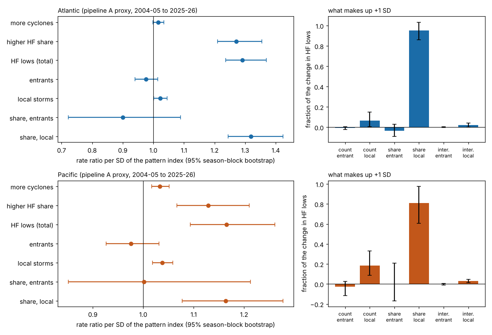

# How the hemispheric pattern works: more cyclones, a larger HF share, or storms entering from upstream? (ERA5 proxy, pipeline A)

Plan, committed before any outcome met the index: [PREREGISTRATION.md](PREREGISTRATION.md) (`44deb16`; deviations are listed at
its end). Code: `chanlib.py`, `channels.py` (24 primary tests, decomposition), `secondary.py` (S1-S7), `power.py`, `report.py`,
`figure.py`. Results: [results/](results/) (`summary.txt` is the readable report; `tests.csv`, `decomposition.csv`,
`secondary.csv`, `power_*.csv`).

All outcomes are **pipeline A** (`research/era5/hf_history`, 800 km ocean gust index, HF-equivalent at 71.7 kt) and a **proxy**,
not the archive. The pattern index is the leave-one-season-out index of hf-low PR 41 (`hemispheric/results/oos_index_*.csv`),
fitted to the archive's weekly HF counts; it is not refitted here. Effects are per SD of that index, over the 22 seasons
2004-05 to 2025-26, Oct-Apr, 660 weeks per basin, effective n 22 seasons. Transitioning tropical cyclones are in.

Reproduce (no ERA5 pull; numpy, pandas, scipy, matplotlib; about 1 minute for `channels.py`, 2 minutes for `secondary.py`,
5 minutes for `power.py`):

    python3 research/era5/hem_channels/channels.py research/era5/hem_channels/results 2000 2000
    python3 research/era5/hem_channels/secondary.py research/era5/hem_channels/results 2000 2000
    python3 research/era5/hem_channels/power.py research/era5/hem_channels/results 400
    python3 research/era5/hem_channels/report.py research/era5/hem_channels/results; python3 research/era5/hem_channels/figure.py research/era5/hem_channels/results

## Answer

**In both basins the pattern works mostly through the share of cyclones that reach hurricane force, not through more cyclones and
not through storms coming in from upstream.** The Atlantic result is clear; the Pacific has a small second channel.

| per +1 SD of the pattern index | Atlantic | Pacific |
|---|---|---|
| HF lows (pipeline A) | x1.29 (1.24-1.37) | x1.17 (1.09-1.26) |
| **share of cyclones reaching HF** | **x1.27 (1.21-1.35)** | **x1.13 (1.07-1.21)** |
| number of cyclones | x1.016 (0.998-1.035), a null with a minimum detectable effect of about 1.03 | x1.033 (1.017-1.051), small but clear |
| storms entering from upstream (count) | x0.98 (0.94-1.02), inconclusive | x0.98 (0.93-1.03), inconclusive |
| share of the change in HF lows: share channel (95% interval) | **92% (82-100%)** | **81% (72-90%)** |
| count channel | 6% (0 to 14%) | 16% (8-25%) |
| entrants' part of the change (their baseline part of HF lows) | -4% (-10 to +2%) (10%) | -2% (-21 to +16%) (17%) |
| f = log RR(share) / log RR(HF) | 0.94 (0.86-1.006) | 0.79 (0.67-0.88) |

Intervals are 95% season-block bootstraps. In words:

- **Atlantic.** +1 SD of the pattern raises the number of pipeline A HF lows by 29%. The number of cyclones barely moves (+1.6%,
  consistent with zero, and an effect above about 3% would have been seen). A 27% larger share of the cyclones reaches HF. By the
  decision rule fixed in advance (whole interval of f above 0.5) this is "share carries most". The agenda's prediction (P1) holds.
- **Pacific.** The share channel again carries most (f 0.79, whole interval above 0.5), but the count channel is real:
  3.3% more cyclones per SD (q = 0.004), about 16% of the effect. That count channel is not stable (below). The pre-registered
  expectation was "both contribute" (P2, f between 0.2 and 0.8); the point estimate sits at the top of that range and the decision rule
  says "share carries most", so P2 is half right and the verdict is share.
- **Entering from upstream.** Entrants are 19% (Atlantic) and 11% (Pacific) of cyclones. They respond no more than local
  storms (T8: Atlantic 0.955, 0.911-0.997, q = 0.11; Pacific 0.940, 0.885-1.002, q = 0.13). Their part of the change in HF lows is
  below their baseline weight in both basins (excess -14 points, -20 to -7, Atlantic; -19 points, -40 to -1, Pacific), so the
  entry channel contributes nothing positive. The Atlantic prediction (P3: entrants respond more) is **not supported**. The share
  of entrants that reach HF is too uncertain to say anything (T6: minimum detectable effect not reached by 1.20).
- **Where HF lows peak.** Position moves a little. Per SD, HF lows peak farther east (Atlantic +1.5 degrees longitude, q = 0.038;
  Pacific +3.4 degrees, q = 0.002) and Pacific storms peak 0.5 degrees poleward (q = 0.004); Atlantic all-track longitude +1.0
  degrees (q = 0.016). The other four position tests do not pass FDR.

So the earlier finding that this pattern "predicts HF counts a week ahead" (PR 41) is, in the proxy, a statement about how many
of the cyclones that exist become HF: the conversion rate. It is not, here, a statement about how many cyclones form or enter.

## Tests (all 24 pre-registered, per SD; p permutation two-sided / q BH across the 24)

12 of 24 pass q < 0.05 (Atlantic: T2, T3, T7, T10, T12; Pacific: T1, T2, T3, T5, T7, T9, T12). The core six (T1-T3 x 2 basins)
pass q < 0.05 within their own family except Atlantic T1 (the cyclone count, q = 0.12). p = 0.0005 is the 2,000-permutation floor.

| test | Atlantic | p / q | Pacific | p / q |
|---|---|---|---|---|
| T1 RR cyclones | 1.016 (0.998-1.035) | 0.117 / 0.140 | 1.033 (1.017-1.051) | 0.0015 / 0.0036 |
| T2 RR share reaching HF | 1.271 (1.210-1.354) | 0.0005 / 0.0017 | 1.129 (1.067-1.210) | 0.0005 / 0.0017 |
| T3 RR HF lows | 1.291 (1.236-1.369) | 0.0005 / 0.0017 | 1.165 (1.093-1.261) | 0.0005 / 0.0017 |
| T4 RR entrants | 0.976 (0.940-1.015) | 0.286 / 0.312 | 0.975 (0.927-1.031) | 0.474 / 0.494 |
| T5 RR local storms | 1.022 (1.002-1.045) | 0.047 / 0.081 | 1.038 (1.019-1.059) | 0.001 / 0.003 |
| T6 share within entrants | 0.900 (0.723-1.089) | 0.253 / 0.289 | 1.001 (0.852-1.212) | 0.988 / 0.988 |
| T7 share within local | 1.319 (1.244-1.423) | 0.0005 / 0.0017 | 1.164 (1.077-1.277) | 0.0005 / 0.0017 |
| T8 entry contrast | 0.955 (0.911-0.997) | 0.076 / 0.113 | 0.940 (0.885-1.002) | 0.098 / 0.129 |
| T9 peak lat, all tracks | +0.36 (-0.01 to +0.72) deg | 0.055 / 0.088 | +0.52 (+0.24 to +0.80) deg | 0.0015 / 0.0036 |
| T10 peak lon, all tracks | +0.97 (+0.18 to +1.77) deg | 0.0075 / 0.016 | +0.53 (-0.36 to +1.42) deg | 0.102 / 0.129 |
| T11 peak lat, HF tracks | +0.78 (+0.14 to +1.43) deg | 0.028 / 0.051 | +0.40 (-0.12 to +0.92) deg | 0.086 / 0.121 |
| T12 peak lon, HF tracks | +1.47 (+0.51 to +2.42) deg | 0.019 / 0.038 | +3.43 (+1.47 to +5.39) deg | 0.0005 / 0.0017 |

Leave-one-season-out ranges (T1-T3): Atlantic T1 1.012-1.022, T2 1.259-1.284, T3 1.280-1.302; Pacific T1 1.030-1.037, T2 1.117-1.148,
T3 1.152-1.187. Every channel direction holds with any one season left out.

## Power (planted-effect simulation, 400 draws per cell; `results/power_*.csv`)

Minimum detectable rate ratio at 80% power: cyclone count 1.03 (both basins); share 1.10 (Atlantic) and 1.11 (Pacific); HF lows
1.10 and 1.11; entrant count 1.07 and 1.09; local count 1.03; share within local 1.11 and 1.13; entry contrast 1.08 and 1.10; share
within entrants not reached by 1.20 (power 17% and 22% at 1.10). Position: 0.5, 1.1, 0.9 and 1.4 degrees per SD (Atlantic
T9-T12); 0.4, 1.3, 0.7 and 2.8 degrees (Pacific), analytic from the clustered SE. So:

- **Well-powered null:** the Atlantic cyclone count (interval inside 0.95-1.05, minimum detectable 1.03). The Pacific count is not a
  null (it is +3%, small).
- **Inconclusive:** entrant counts (intervals reach 0.93-1.03, wider than the 0.95-1.05 band), the entrant share (T6), the entry
  contrast, and the HF-track latitude shifts.

## Secondary checks (own BH family, labelled secondary; `results/secondary.csv`)

| check | Atlantic: RR cyclones / share / HF lows; f | Pacific: RR cyclones / share / HF lows; f |
|---|---|---|
| S1 fixed-depth HF (966.2 / 965.0 hPa) | 1.016 / 1.228 / 1.247; f 0.93 (0.84-1.01) | 1.033 / 1.101 / 1.137; f 0.75 (0.45-0.89) |
| S2b no previous-week term | 1.016 / 1.260 / 1.280; f 0.94 | 1.030 / 1.140 / 1.175; f 0.82 |
| S3 leave out peaks north of 60N | 1.013 / 1.259 / 1.276; f 0.95 (0.81-1.06) | 1.014 / 1.147 / 1.163; f 0.91 (0.81-1.04) |
| S4a seasons 2004-14 | 1.017 / 1.274 / 1.296; f 0.93 | 1.051 / 1.134 / 1.191; f 0.72 (0.54-0.83) |
| S4b seasons 2015-25 | 1.015 / 1.249 / 1.268; f 0.94 | 1.016 / 1.117 / 1.135; f 0.87 (0.66-1.17) |
| S6 add a season trend | 1.015 / 1.268 / 1.287; f 0.94 | 1.034 / 1.132 / 1.170; f 0.79 |
| **S7 1979-80 to 2000-01, frozen pattern, depth HF (seasons never used to fit)** | 0.986 / 1.262 / 1.245; f 1.06 (0.99-1.15) | 0.987 / 1.172 / 1.158; f 1.09 (0.97-1.24) |
| S5 archive weekly HF lows, total only | HF lows 1.236 (1.159-1.329) | HF lows 1.193 (1.108-1.308) |
| S2a local storms first seen below 1000 hPa (count) | 1.050 (1.012-1.092), q 0.014 | 1.079 (1.046-1.115), q 0.001 |
| S2a local storms first seen at 1000 hPa or above | 0.993 (0.954-1.033) | 0.979 (0.956-1.002) |

- The share channel holds in every variant, in both halves of the record, with a trend term, without the previous-week term,
  without peaks north of 60N (so it is not the Greenland barrier-flow stratum of PR 29), and on 1979-2000 seasons that were never
  used to fit the pattern or this analysis (S7; within-era use only, depth-based because pre-2001 gust values drift, decision 1).
  S7 reproduced PR 41's S5 totals exactly (1.245, 1.158) before its channels were read.
- **The Pacific count channel is not stable**: +5.1% in 2004-14, +1.6% in 2015-25 (interval includes 1), and 0.987 in 1979-2000.
  The share channel is +13%, +12% and +17% in the same three samples. With the fixed-depth definition the Pacific interval of f
  (0.45-0.89) spans 0.5, so on depth the Pacific verdict would be "both contribute"; on gust it is "share". PR 52 says gust is the
  better stand-in for archive-like counts.
- The count channel in the Pacific comes from local storms that are already deep when first detected (S2a), not from new genesis.
- Proxy against archive: the same model on archive weekly counts gives 1.236 and 1.193 per SD (pooled leave-one-season-out), the
  proxy 1.291 and 1.165. PR 41's 1.18 per SD for both basins was estimated on the 11 held-out seasons only (post hoc), so the
  numbers are not directly comparable.

## What this does not show

- **Not a cause.** The pattern is a one-week-ahead association in reanalysis; storms feed back on the fields. The share channel says
  the extra HF lows come from cyclones that already exist and are converted, not why: a stronger jet may raise gust at a given
  depth, deepen the storm, or lengthen its life. S1 (depth) gives the same split for the Atlantic and a weaker one for the
  Pacific, so it is more than a windier environment, but this analysis does not separate deeper storms from faster deepening or
  longer lives (PR 11 found no deepening-rate change from NAO or PNA).
- **"Entering" means a low first seen at least 12 h before it appeared in the basin box** (Atlantic 30-67N, 98W to 10E; Pacific
  27-67N, 135E to 120W). It misses storms born just inside the box in response to an upstream trough, which are counted as local.
  The Atlantic box starts at 98W, so lows from the Rockies and Great Plains are entrants only if first detected west of it.
- **Proxy only.** The archive has no cyclone denominator, so the split cannot be run on it; the archive's own total effect is
  in S5. A cyclone is any pipeline A track (below 1010 hPa for 24 h), so weak and strong lows count the same in the denominator.
- **Index fitted to the archive.** The pattern is out of sample for each season but its weights were fitted to archive HF counts of
  the other 21 seasons. Effects on pipeline A are a transfer; the weekly pipeline A HF counts were seen against the frozen pattern
  in PR 41 (S4).
- **The 2015-25 seasons have been looked at at least six times** (`hemispheric/results/heldout_looks.log`; this analysis is the
  sixth and S7 is the second look at pre-2001 seasons). This is a decomposition of an effect already found, not a new search.
  S4a and S4b are consistency checks, not independent replications (the index is leave-one-season-out). S7 is the one replicate on
  seasons that never entered a fit; it holds.
- Effective n is 22 seasons (about 5 independent index values per season), not 660 weeks or 20,000 cyclones. Permutation p-values
  come from 2,000 draws (floor 0.0005); bootstrap intervals with 22 clusters are somewhat optimistic.

## Verification

A fresh Sonnet agent that had not seen this code or its results recomputed, with its own implementation (statsmodels Poisson
and OLS, from `all_tracks.csv.gz`, `fixes_2004.csv.gz`, `oos_index_*.csv`, `weekly_table.csv.gz`, `frozen_primary.json`), and
**matched** to three decimals: the window counts (9,656 / 1,007 / 1,823 / 100 and 10,040 / 825 / 1,126 / 141 tracks, HF lows,
entrants, HF entrants; 14 and 9 tracks missing from the fixes table); RR per SD for cyclones, HF lows, share, entrants, local
storms, share within local and within entrants; f (0.939, 0.791); the absolute decomposition (share 0.921 and 0.809, count
0.057 and 0.161, entrants -0.040 and -0.024 against baseline 0.099 and 0.171, total change 303 and 139); all eight position
estimates; S7 (1979-2000, depth HF, frozen pattern: 0.986 / 1.262 / 1.245 and 0.987 / 1.172 / 1.158); and the S4 halves for HF
lows and share.

**Not independently checked:** permutation p and BH q values, bootstrap and clustered intervals, leave-one-season-out ranges,
the power simulation, S1, S2a, S2b, S3, S5 and S6, the f intervals, the entrant-excess intervals, and the figure.
