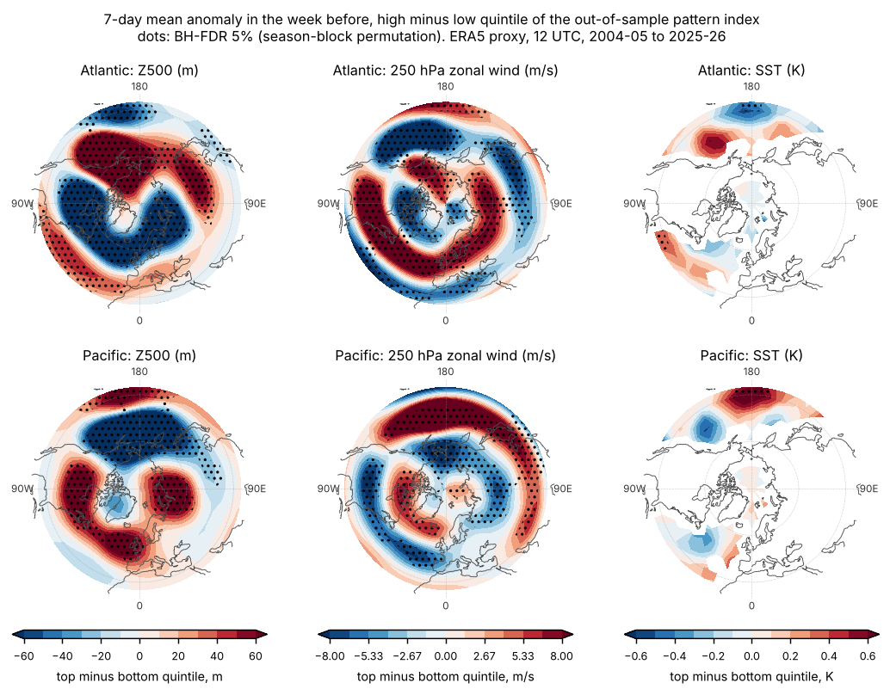

# Is there a hemispheric state that leads to more hurricane-force lows? (data-driven, ERA5 proxy fields)

Plan, committed before any outcome met a predictor: [PREREGISTRATION.md](PREREGISTRATION.md) (`1ff3201`). Models frozen
before the held-out look: `4947105`. Deviations and post hoc checks are listed at the end of the plan.
Code: `fields.py` (reads WeatherBench2 and ARCO-ERA5, about 17 GB streamed in all), `hemlib.py`, `run.py`, `attribute.py`,
`posthoc.py`, `posthoc2.py`, `fdr.py`, `figures.py`, `export_tables.py`. Results: [results/](results/).

Outcome: the **archive's** weekly counts of hurricane-force lows per basin (Oct-Apr, 2004-05 to 2025-26). Predictors:
**ERA5 reanalysis fields, a proxy for the atmosphere** (5.6 degree, 12 UTC daily, 7-day means over days -7 to -1 before
the week). Pipeline A (800 km gust index, 71.7 kt) appears only in the proxy-outcome checks S4 and S5, and says so.

## Answer

**Yes, in both basins, about a week ahead. The state is a hemispheric wave-and-jet pattern, and it is mostly not a
combination of NAO, PNA, ONI and the MJO.**

- Fitted on 2004-05 to 2014-15 and scored once on 2015-16 to 2025-26 (11 held-out seasons, 330 weeks, 458 Atlantic and 421
  Pacific archive lows), the pattern predicts weekly HF counts better than month plus the previous week's count: held-out
  deviance skill **+5.6% Atlantic** (permutation p = 0.0001, Family 1 BH q = 0.0003) and **+2.3% Pacific** (p = 0.0011,
  q = 0.0013). The held-out seasons were scored once for this test; the pattern beat the baseline in 9 of 11 Atlantic and 7 of
  11 Pacific held-out seasons. Swap the halves (train 2015-26, test 2004-15) and it holds: +4.2% (p = 0.0001) and +2.6%
  (p = 0.011).
- The skill is modest. Weekly counts are mostly noise: a 5.6% gain in deviance is a real signal, not a forecast. Weeks in the
  top fifth of the held-out pattern index had **1.83 HF lows per week against 1.11 in the bottom fifth in the Atlantic
  (1.66 times) and 1.79 against 0.79 in the Pacific (2.27 times)**; against what month and the previous week alone predict, the
  ratios are 1.50 and 1.57. Rate ratio per SD of the index, estimated on the held-out weeks (post hoc): Atlantic 1.18
  (95% season-bootstrap 1.09-1.27), Pacific 1.18 (1.09-1.29).
- **The four lagged named indices do not predict out of sample at all.** NAO, PNA, ONI and MJO (main effects) give -2.5%
  (Atlantic) and -1.3% (Pacific) against the same baseline, worse than none; adding the products makes it -2.0% and -7.1%.
  Over all 22 seasons leave-one-season-out, the named model is -0.5% in both basins and the pattern is +5.7% and +3.4%
  (the pattern beats the baseline in 19 of 22 Atlantic and 14 of 22 Pacific seasons).

### What the pattern looks like

Seven-day mean anomaly in the week before, top minus bottom quintile of the out-of-sample pattern index (dots: BH-FDR 5%
by season-block permutation). The Z500 and 250 hPa wind patterns of the first and second halves of the record match
(spatial correlation 0.92 and 0.89 Atlantic, 0.87 and 0.87 Pacific); the SST maps do not (0.41, 0.54).

- **Atlantic.** A ridge over Alaska and the north-east Pacific (about +140 m in the 37-53N band near 135W), a deep trough
  over central and eastern North America (about -110 m near 90W), and a stronger, longer jet from eastern North America out
  over the Atlantic (+7 to +10 m/s at 250 hPa from 90W to 20W). Across the hemisphere heights are higher at mid-latitudes and
  lower over the Arctic (zonal mean +14 m at 42N, -17 m at 65N). In words: a cold-air outbreak pattern off North America with
  a jet pointing into the Atlantic.
- **Pacific.** A deep trough over the North Pacific (about -116 m near the dateline), the Pacific jet extended across the
  dateline (+14 m/s), a ridge over central North America (+61 m near 90W), and higher heights over the pole (+15 m at 82N, zonal mean). In
  words: a deep Aleutian low with an extended jet, like a strong positive PNA.
- Z500 and 250 hPa wind each carry it alone (post hoc: Atlantic +5.1% and +5.8%, Pacific +2.1% and +2.4% held out); SST
  alone does not (+0.5%, p = 0.05; +0.1%, p = 0.24), and leaving SST out does not weaken it.

### Known combination or something else

On all 22 seasons, the pattern index, produced out of sample (each season's index from a fit on the other 21), regressed on
NAO, PNA, ONI, MJO1, MJO2 and the three products (with month effects): adjusted R-squared **0.13 Atlantic (95% season-block
bootstrap 0.11-0.24) and 0.30 Pacific (0.26-0.41)**. So about 87% and 70% of the pattern's variation is not in those indices. With the AO added: 0.20
and 0.33. The Pacific index tracks the PNA (r = +0.50); the Atlantic one is mostly its own (PNA r = -0.33, AO r = +0.27, NAO
r = +0.09). A random forest on the same indices and the month does no better (cross-validated R-squared 0.08 and 0.27), so it
is not a nonlinear combination of them either. The pattern also carries information beyond the named indices on the
held-out seasons (P4: +4.7% Atlantic, +1.1% Pacific; both q < 0.001). By the rule fixed in advance this is "partly new / mostly not
a known combination". It is not claimed to be new physics: a trough-ridge-jet wave pattern of this size is a familiar kind of
structure; what is shown is that it carries HF information the four lagged indices do not.

### What did not work, and limits

- **Weak at two weeks.** With the window moved to days -14 to -8 the skill is +2.2% (Atlantic, p = 0.09) and +0.25% (Pacific,
  p = 0.23): not detectable. The state is a one-week lead.
- **Part of the same-week association is circular.** With the concurrent week as predictor the skill doubles (+10.8%, +5.3%);
  that contrast is not used for inference.
- **SOM regimes** (secondary method, a 3 x 3 map on Z500) are weak: +0.9% Atlantic (p = 0.045, Family 2 q = 0.06) and -2.7%
  Pacific. The supervised pattern finds what unsupervised regimes do not.
- **Pacific is weaker.** Its skill against the named model (P3) has a 95% interval that includes 0 (-0.001 to +0.072; one-sided
  p = 0.029, q = 0.029); the Atlantic is clear (+0.08, 0.05 to 0.11).
- **Power.** With 11 held-out seasons the test had 80% power at a rate ratio of 1.15 per SD of the frozen pattern index (both
  basins; 53-55% at 1.10; planted-effect simulation with Poisson counts, the training-period dispersion was 1.0).
- Not a cause. The pattern could favour genesis, steer storms into the basin, or both. The archive is the outcome, so the
  recording process is a possible confound that this does not remove.
- **Checks that did not remove it (post hoc):** adding the previous week's count of all pipeline A cyclones (storm-track
  imprint) leaves Atlantic skill at +5.5% (Pacific +1.4%, p = 0.004); adding annual harmonics of week of season gives +7.0% and
  +2.1%.
- **Proxy outcomes, same frozen model.** On pipeline A HF-equivalent counts (a proxy; same storms), held-out skill is +7.6%
  Atlantic (p = 0.0001) and +1.6% Pacific (p = 0.0045). Within 1979-80 to 2000-01 only (decision 1: within-era variation, no
  level or trend), with pipeline A *depth* counts and the frozen pattern as one regressor, the rate ratio per SD of the index is
  1.245 Atlantic and 1.158 Pacific (both p = 0.0002, 1,011 and 877 storms). The pattern was fitted on 2004-05 to 2014-15 only.

## Tests

All p-values are one-sided permutation tests by season block (10,000 permutations). Family 1: the six primary tests (q
over six). Family 2: all 24 pre-registered tests. Full table with q values: `results/fdr_table.csv`.

| test | Atlantic p (q1) | Pacific p (q1) |
|---|---|---|
| P1 pattern vs month + previous week (SS) | 0.0001 (0.0003); +5.6% | 0.0011 (0.0013); +2.3% |
| P3 pattern vs named indices (delta SS) | 0.0001 (0.0003); +0.081 | 0.029 (0.029); +0.036 |
| P4 pattern + named vs named (SS) | 0.0002 (0.0004); +4.7% | 0.0004 (0.0006); +1.1% |
| S1 swap split, P1 | 0.0001 (q2 0.0005); +4.2% | 0.011 (q2 0.019); +2.6% |
| S2 lag 8-14 days, P1 | 0.092 (q2 0.11); +2.2% | 0.23 (q2 0.25); +0.25% |
| S3 SOM regimes | 0.045 (q2 0.06); +0.9% | 0.26 (q2 0.27); -2.7% |
| S4 proxy outcome, P1 analogue | 0.0001 (q2 0.0005); +7.6% | 0.0045 (q2 0.0098); +1.6% |
| S5 1979-2000 depth counts, rate ratio per SD | 0.0002 (q2 0.0006); 1.245 | 0.0002 (q2 0.0006); 1.158 |

## Reproduce

Fields (about 17 GB, 15 min; below the 50 GB gate; `OUT` is `work/`, ignored):

    python3 research/era5/hemispheric/fields.py OUT              # also: fields.py OUT overlap
    python3 research/era5/hemispheric/run.py freeze OUT results primary,swap,lag2,conc
    python3 research/era5/hemispheric/run.py evaluate OUT results primary,swap,lag2,conc   # the held-out look
    python3 research/era5/hemispheric/attribute.py OUT results
    python3 research/era5/hemispheric/posthoc.py OUT results; python3 research/era5/hemispheric/posthoc2.py OUT results
    python3 research/era5/hemispheric/fdr.py; python3 research/era5/hemispheric/figures.py

`results/weekly_table.csv.gz` holds every weekly count, index and primary-split PC score (0.2 MB) so the held-out numbers can
be recomputed without the fields. Repeating `evaluate` is a further look at the held-out seasons.

## Verification

Two fresh Sonnet agents that had not seen the code or the README recomputed with their own implementations.

**Matched (statistics, from `weekly_table.csv.gz` and the frozen coefficients):** held-out event totals (458, 421); SS(P|B1) +0.0555 and +0.0232; SS(N|B1) -0.0253 and -0.0132; the Atlantic P1 p at the 0.0001 floor and the Pacific P1 p (0.0002 to 0.0010 across seeds, the claimed 0.0011 is Monte Carlo noise); seasons won (9 of 11 Atlantic; Pacific 7 of 11 against the frozen B1, 8 of 11 if each model is compared with its own non-pattern terms); quintile rates (1.833/1.106, 1.788/0.788); attribution adjusted R-squared 0.134 and 0.300 (main effects only 0.125 and 0.299); pipeline A proxy transfer +0.0755 and +0.0157.

**Matched (fields):** Z500, U250 and MSLP at six dates, three from WeatherBench2 (bit-exact) and three from ARCO (rms at most 0.008 m, 0.002 m/s, 0.001 hPa); no NaN outside SST; the SST mask is static and covers all land plus some coastal cells.

**Not independently checked:** the EOF and ridge fits themselves (the verifier used the frozen coefficients), lambda selection, the swap, lag-2 and concurrent rows, the SOM, P3 and P4 intervals and p-values, the power simulation, the composite maps and half-to-half map correlations, FDR q values, S5 within-era, the post hoc rows PH1 to PH5, and the held-out rate ratios per SD. These come from `run.py`, `attribute.py` and `posthoc*.py` as committed.
