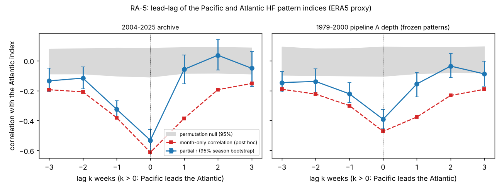

# Does a Pacific state lead the Atlantic HF state by about a week? (RA-5; ERA5 proxy)

Plan, committed before any Pacific predictor met an Atlantic outcome: [PREREGISTRATION.md](PREREGISTRATION.md) (`3a71ae4`);
deviations are logged at its end. Code: `leadlib.py`, `run.py` (18 tests), `extras.py` (S2 difference, S5, S6, S7), `power.py`,
`posthoc.py`, `figure.py`. Results: [results/](results/). Predictors are the out-of-sample weekly pattern indices of PR 41
(ERA5 reanalysis, a **proxy** for the atmosphere); the outcome is the **archive's** weekly HF counts, 22 seasons 2004-05 to
2025-26, 616 weeks per basin (weeks 2-29). Pipeline A (ERA5 proxy counts) appears only in S3 (1979-2000 depth counts) and S4.

## Answer

**No, at the weekly resolution of the data: a Pacific pattern index one or two weeks earlier does not predict the Atlantic HF
state, and the data exclude a positive lead of the size that would matter.** The strongest feature is not a lead but a
same-week seesaw: the two indices are anticorrelated (-0.60 in the same week).

- **Lag 1 week (Pacific days -14..-8, Atlantic days -7..-1).** Atlantic archive count: rate ratio **0.95 per SD of the
  Pacific index (95% season bootstrap 0.89-1.01)**, one-sided p for a positive lead 0.96 (q 0.96); the nominal p for a
  negative sign is 0.036, not a pre-registered test. Atlantic index, controlling its own previous week: partial r **-0.06
  (-0.15, +0.03)**. Pacific archive count of the previous week: RR 1.00 (0.95-1.07).
- **Lag 2 weeks.** RR **1.02 (0.97-1.09)** on the count (p 0.29, q 0.71) and partial r **+0.04 (-0.05, +0.13)** on the index
  (p 0.19, q 0.71); Pacific count RR 1.01 (0.94-1.09).
- **0 of 6 primary tests and 0 of 18 pre-registered tests pass FDR** in the predicted (positive) direction (smallest Family 2 q
  0.176).
- **Power.** Planted-effect simulation: at RR 1.10 per SD the lag-1 count test has **83%** power at one-sided p < 0.05
  (65% at the Bonferroni-6 level) and the lag-1 index test **84%** at partial r = 0.10 (66%). Minimum detectable effect at
  80% power (p < 0.05): RR about 1.09, partial r about 0.095. The lag-1 intervals' upper ends (RR 1.014, r 0.028) are well under both,
  so a positive lead of that size is excluded; at lag 2 the index interval reaches r = 0.13, so a small positive lead there is
  not excluded. By the decision rules fixed in advance (rule 3, with the stated power level) this is **"no" at lag 1**; lag 2 is
  "no detectable" on the count and "can't exclude r up to 0.13" on the index.
- **The prediction (positive lag-1 association) was not met.** The Pacific ridge in the Atlantic pattern (PR 41) is therefore
  coincident with the Atlantic state at this resolution, not a precursor of it.

## Tests (ERA5 proxy indices; archive counts; one-sided permutation p by season block, 10,000 shuffles)

| test | estimate (95% interval) | p positive | q family 1 / q family 2 |
|---|---|---|---|
| P1 Atlantic count on Pacific index, lag 1 | RR 0.952 (0.892-1.014) | 0.964 | 0.964 / 1.000 |
| P2 same, lag 2 | RR 1.020 (0.968-1.088) | 0.287 | 0.709 / 0.938 |
| P3 Atlantic index on Pacific index, lag 1 | slope -0.060 (-0.158, 0.027); partial r -0.060 (-0.152, 0.028) | 0.961 | 0.964 / 1.000 |
| P4 same, lag 2 | slope +0.033 (-0.044, 0.112); partial r +0.038 (-0.050, 0.131) | 0.190 | 0.709 / 0.855 |
| P5 Atlantic count on Pacific count, lag 1 | RR 1.003 (0.955-1.068) per SD of log count | 0.584 | 0.876 / 0.980 |
| P6 same, lag 2 | RR 1.010 (0.936-1.086) | 0.354 | 0.709 / 0.938 |
| S1-P1..P4 with NAO, PNA, ONI, MJO controls | RR 0.982, 0.999; slope -0.018, +0.070 | 0.78, 0.54, 0.69, **0.025** | q2 0.98, 0.98, 0.98, 0.176 |
| S2 reverse (Atlantic leads Pacific), count / index | RR 0.985; slope **+0.058** (0.001, 0.127) | 0.74; 0.029 | q2 0.98; 0.176 |
| S3 1979-2000, pipeline A depth counts, frozen patterns: P1, P2, P3, P4 | RR **1.076** (1.005-1.152), 0.999; slope **-0.153** (-0.228, -0.080), -0.022 | 0.012, 0.45, 1.00, 0.82 | q2 0.176, 0.98, 1.00, 0.98 |
| S4 2004-2025, pipeline A HF-equivalent counts: P1, P2 | RR 0.992, 1.012 | 0.64, 0.36 | q2 0.98, 0.94 |

Every test is in `results/tests.csv` with the negative-direction p. Effective n is 22 seasons; bootstrap and permutation units
are seasons.

## What the same-week seesaw does to a lead-lag reading

- The two out-of-sample indices correlate **-0.60** in the same week (2004-2025; -0.48 in 1979-2000). The patterns share the
  north-east Pacific / North America sector with opposite signs (the Atlantic's Alaska ridge against the Pacific's Aleutian low).
- A month-only lagged correlation (post hoc; red dashed line in the figure) is **symmetric about lag 0** and negative at every
  lag: -0.61 at lag 0, -0.39 at lag +1, -0.38 at lag -1 (2004-2025). There is no asymmetry that a Pacific lead would produce.
- With the Atlantic index's own previous week held fixed the lag-1 partial coefficient is slightly negative (-0.06). A hypothesis, not
  tested here: the previous-week Atlantic index is a noisy measure of the Atlantic state, and the Pacific index carries the
  opposite-signed information about it, which gives a small negative coefficient without any lead.

## Loose ends and limits

- **The 1979-2000 count analogue (S3-P1) is positive** (RR 1.076, 1.005-1.152, p 0.012, q 0.176) while the same test in 2004-2025
  is 0.95; the intervals touch near 1.01. Its index analogue (S3-P3) is the most negative of all (partial r -0.16). It is a
  within-era depth-count test with the pre-2004 frozen pattern, not a replication of a primary effect, because no primary test
  was positive. Taken as a lead it does not survive FDR, and I would not rely on it.
- **The sign of the small negative partial coefficient is not stable across periods** (P3 slope +0.01 in 2004-14, -0.20 in 2015-25;
  descriptive, S7; S3-P3 is -0.15), so it should not be read as a finding.
- **Reverse direction (S2): the Atlantic index leads the Pacific one slightly** (+0.058, p 0.029, q 0.176; difference Pacific-to-Atlantic
  minus Atlantic-to-Pacific -0.118, interval -0.252 to -0.001; 1979-2000 -0.211, -0.317 to -0.115). It does not pass FDR; it is
  the opposite of the downstream-development prediction.
- **Weekly resolution.** The lag-1 windows are centred seven days apart, which brackets the literature's wave-breaking lag
  (about six days) but cannot see any structure inside the week. The daily version needs the daily fields (the 17 GB pull of
  `hemispheric/fields.py`) and was not run; it is the one thing that could still show a short-lag lead.
- **The Pacific variable is the one fitted to Pacific counts.** A lead of some other Pacific feature would not show here.
- **Power.** 22 seasons; effects of RR 1.05 or r 0.05 are detected only 42-44% of the time (p < 0.05). Poisson dispersion of the null
  fit is 0.86, so the Poisson simulations are slightly conservative.
- Not a cause, and says nothing about the daily wave-breaking structure.

## Looks spent

One look at all 22 seasons (the seventh at 2015-16 to 2025-26, one at 2004-14) with leave-one-season-out indices, and the
third look at 1979-80 to 2000-01. Appended to `hemispheric/results/heldout_looks.log`.

## Reproduce

No fields are needed; everything reads committed tables of PR 41. About 40 s for the tests, 11 min for the power simulation.

    python3 research/era5/pacific_lead/run.py          # results/tests.csv (10,000 shuffles, 2,000 bootstrap draws)
    python3 research/era5/pacific_lead/extras.py       # lag_profile.csv, extras.json
    python3 research/era5/pacific_lead/posthoc.py; python3 research/era5/pacific_lead/figure.py
    python3 research/era5/pacific_lead/power.py 400 1000   # power.csv

## Verification

A fresh Sonnet agent that had not seen the code or this README wrote its own implementation (Poisson IRLS, OLS, month
dummies from dates) and recomputed from the committed PR 41 tables and `frozen_primary.json`.

**Matched:** P1, P2, P3, P4, P5 estimates and partial r (to 4 decimals); P1 and P3 permutation p in both directions (within Monte
Carlo error, 5,000 shuffles); the same-week index correlation (-0.600; 1979-2000 -0.482); the month-only lagged correlations at
lags +1, 0, -1; the 1979-2000 P1 and P3 analogues; the half-by-half P1 and P3 numbers. Bootstrap interval ends agreed to within
0.008 (bootstrap noise).

**Not independently checked:** the power simulation; p and q values other than P1 and P3 (and all q values); S1, S2, S4 rows;
the S5 profile and its permutation envelope; the S2 slope difference and its interval; the interval for P5, P6.
